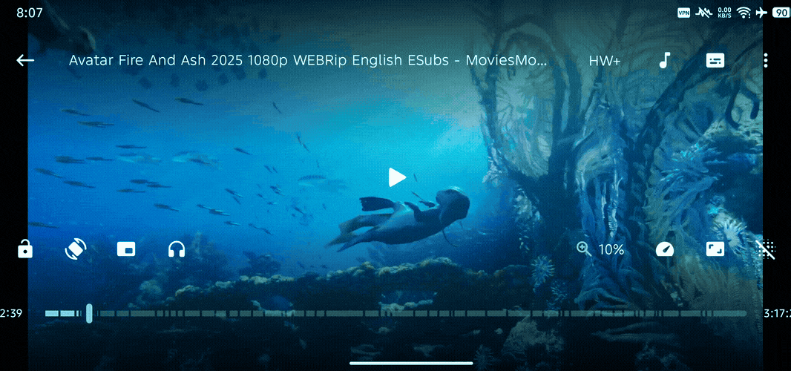

<h1 align="center">Released 🎉</h1>

  

  

<h1 align="center">MpvRxN</h1>

  <b>Feature-rich, Efficient Powerful Android video player based on libmpv.</b>
   

- <i>MpvRxN: Fully vibe-coded app with Claude AI </>

  <i>No ads. No trackers. No noise. Just a serious video player with a calmer surface and a sharper edge.</i>

  
  
  <img

---

# Changelogs

All notable changes to MpvRxN are documented here.

---

## [v1.5.0] — June 2026

### ✨ New Features

- **Audio file support with thumbnails** — new toggle in *Settings → Audio → "Audio Player"*. Shows MP3, FLAC, AAC,  M4A, OPUS, and more alongside videos in every folder, with embedded album art. Off by default — no extra scanning until enabled.
- **Swipe to switch tabs** — swipe left/right anywhere on the home screen to switch tabs, even when the navigation bar is completely hidden. Wraps from last tab back to Home; always opens on Home.
- **Long-press folder/title to scroll top** — long-press the folder name (in any folder screen) or the home title to instantly scroll back to the top.
- **FAB quick play** — single tap plays the most recently played video; long-press opens the original menu (Open File, Recently Played, Open Link).
- **Long-press the speed button** to reset playback speed to your default.
- **Easy Unlock toggle** — when enabled, a lock icon appears on both sides of the screen while controls are locked; tap either to unlock. Swipe-to-unlock always works regardless of this setting.
- **Search auto-opens the keyboard** when tapped.
- **Smooth Back Animation toggle(A13+)** (Settings → Appearance → Animations) — choose between a when on: "predictive back animation" when off animation won't happen(Android 13+).
**Background play doesn't exist app** — Now when we press background play button the player doesn't go back to launcher instead it goes back where the file is being play.
- **Folder navigation via notification** — opening the app from a folder-specific notification jumps straight to that folder.

### 🎨 UI & Player Improvements

- **Transparent overlays** — volume, brightness, speed, and seek overlays now have fully transparent backgrounds instead of dark semi-transparent ones, with white text/icons for readability.
- **Speed pill cleanup** — removed the arrow icon from the speed pill; now shows only the value (e.g. `1.5x`), no border.
- **Speed panel removed** — the full slider panel that used to appear during swipe-to-change-speed is gone; only the simple pill shows now.
- **Changed swipe speed start point** — swiping to change speed now starts from the preset nearest your hold-speed setting, instead of always jumping to 2x.
- **Seekbar** — consistently thin (no longer changes thickness while scrubbing), smaller thumb for a cleaner look. Portrait layout now puts the seekbar on top with timers shown below.
- **Landscape play/pause button** — removed background color and ripple effect.
- **Pill position** — speed/seek pill moved higher on screen in portrait.

### ⚡ Performance

- **Folder loading** — first open loads from MediaStore and caches to disk; every open after is instant (even after an app restart or device reboot), with a silent background refresh to stay up to date.
- **Camera-folder hang fixed** — playback info is now fetched in a single batched DB call instead of one query per video.

### 🎬 Picture-in-Picture

- **PiP controls fixed** — Play/Pause, Rewind (−10s), and Forward (+10s) buttons inside PiP mode now work correctly.

### 🐛 Bug Fixes

**Rotation/black-screen flash on exit** — this has been a recurring issue across many sessions, with several genuinely separate root causes found and fixed one at a time:
- The system back callback was being silently disabled during normal playback, so pressing back via gesture/button could skip custom exit logic entirely (background audio stopping, folder-return not happening) — only the on-screen back arrow worked correctly. Now always enabled.
- The exit-orientation lock could be overwritten mid-transition by an unrelated async process (video-aspect-ratio orientation logic), undoing the fix intermittently.
- The "instant exit" animation setting wasn't actually taking effect due to a call-ordering bug (`overridePendingTransition` was called after `finish()`, too late to apply).
- Android 14+'s own predictive-back preview snapshot (shown during a swipe gesture) is now explicitly suppressed for the player's exit transition.
- The manual "background play" button had its own separate flash, caused by system UI bars being restored before orientation was locked — fixed by locking orientation first.
- PiP broadcast handling hardened (separate, explicit broadcast actions with `FLAG_MUTABLE`) instead of relying on default intent matching, which was contributing to flashes during PiP-related transitions.
- *(Historical first attempt)* The very first fix for this bug — disabling `enableOnBackInvokedCallback` app-wide — masked the issue but also disabled predictive back everywhere. This was later replaced by enabling it specifically for the player with full custom handling above, fixing the underlying causes instead of just hiding the symptom. 

### 🔧 Build & Identity

- **Package name**: `app.gyrolet.mpvrxn` — installs alongside the original MpvRx without conflict.
- **Launcher name**: `MpvRx` (unchanged) · **Home screen title**: `MpvRxN`
- **APK signing** automated via GitHub Actions — every build is signed and installs without warnings.
- **Builds**: `arm64-v8a` and `armeabi-v7a` only (x86/x86_64 removed).
- **APK naming**: `MpvRxN-arm64-v8a.apk` / `MpvRxN-armeabi-v7a.apk`.
- **About screen**: shows `MpvRxN`, version, author, and fork GitHub URL.

### 💡 Known Limitations

- With the **system-wide Android "Predictive Back Animations" developer setting** enabled, a very brief black-screen flash can still occasionally occur on exit. Disabling that system setting avoids it entirely; this is separate from the in-app "Smooth Back Animation" toggle.
- A few 10-bit/AVI files may still show inconsistent thumbnails on some devices.
- The day/night theme-switch playback interruption fix may not fully resolve the issue on every device/Android skin, since part of the relevant surface-handling code lives in a precompiled library (`mpvlib.aar`) outside this fork's source.

---

## Earlier Fork Changes (pre-v1.5.0)

These are the original modifications made when first forking from upstream MpvRx, before the v1.5.0 development cycle above.

- Removed dark backgrounds from all gesture overlays (volume, brightness, speed, seek) — replaced with transparent backgrounds and white text.
- Removed the FastForward arrow icon from the speed pill.
- Removed the full speed-slider panel during swipe gestures in favor of the simple pill.
- Changed swipe-speed always starting at 2x regardless of hold-speed setting.
- FAB quick-play (single tap to play most recent video, long-press for menu) introduced for the first time.
- Attempted to fix for the landscape rotation-flash bug (`enableOnBackInvokedCallback="false"` app-wide).
- Changed `applicationId` to `app.gyrolet.mpvrxn` to allow installing alongside the original app.
- Set up GitHub Actions CI/CD with automatic APK signing (keystore secrets) and trimmed build to `arm64-v8a`/`armeabi-v7a` only.

## Showcase

  

 

  
  
  

 

  
  

---

## Features

MpvRx pushes the mpv-android experience further with deep customization, thermal-aware performance, and unique quality-of-life features. Here's what sets it apart:

<b>🎨 Theme & Visual System</b>

| Feature | Description |
|---|---|
| **25+ Color Themes** | Default, Dynamic (Material You), Catppuccin, Nord, Tokyo Night, Rose Pine, Gruvbox, Dracula, and many more |
| **AMOLED Pure Black Mode** | Every theme has a dedicated variant with pure black backgrounds |
| **Player Controls Animation** | 5 animation styles: Default, Elastic Bounce, Cinematic Scale, Slide Up, Minimal Fade |
| **Always Dark Mode** | Option to keep player controls in dark theme regardless of app theme |
| **Themed Player Controls** | Adaptive controls that match your app theme or system accent |

<b>🖐️ Gesture System</b>

| Feature | Description |
|---|---|
| **Refined Tap Logic** | Configurable double-tap seek zones (left/center/right) with independently assignable actions |
| **Multi-Tap Continuous Seeking** | Triple/quadruple tap to keep seeking further without lifting |
| **Horizontal Swipe to Seek** | Swipe across video to seek with live time/delta overlay |
| **Long-Press Dynamic Speed** | Long-press activates configurable speed boost; swipe left/right to adjust across 8 presets |
| **Subtitle Drag Gesture** | Long-press center screen to drag subtitles vertically when active |
| **Pinch-to-Zoom with Pan** | Pinch to zoom (-1x to 3x) with simultaneous pan and single-finger pan after zoom |
| **Volume Boost via Gesture** | Vertical swipe volume can exceed 100% into configurable boost range |
| **Swap Volume/Brightness Sides** | Option to swap which screen side controls volume vs brightness |

<b>📺 HDR & Video Pipeline</b>

| Feature | Description |
|---|---|
| **Shader-Based HDR Pipeline** | Powered by [hdr-toys](https://github.com/natural-harmonia-gropius/hdr-toys) — 77 bundled GLSL shaders |
| **Four HDR Modes** | BT.2100 PQ (HDR10), BT.2100 HLG, BT.2020 gamut mapping, Linear HDR |
| **SDR-to-HDR Boost** | Boost SDR content into HDR range when using Linear HDR pipeline |
| **GPU Deband** | CPU (gradfun) or GPU deband with configurable iterations, threshold, range, grain |
| **Smart Render Backend** | Auto-selects between OpenGL/Vulkan and gpu/gpu-next based on device support |

<b>🔥 Thermal & Battery Management</b>

| Feature | Description |
|---|---|
| **ThermalMonitor** | Samples thermal headroom every 10s during playback |
| **Adaptive Shader Budget** | Ambient shader budget auto-capped based on thermal headroom |
| **Anime4K Proactive Throttling** | Auto-downgrades Anime4K quality when thermal headroom drops below 40% |
| **Background Poll Optimization** | Position poll interval doubles when controls are hidden, cutting JNI wake-ups 50% |
| **Stats Poll Backoff** | Stats page poll loop backs off from 1s to 2s when playback is paused |

<b>🧩 Anime4K & Upscaling</b>

| Feature | Description |
|---|---|
| **7 Preset Quality Tiers** | Off, A, B, C, A+, B+, C+ with clean switching |
| **Quality Tiers in Decoder Settings** | Fast / Balanced / High quality choices |
| **4K/8K Safety Guard** | Auto-disables Anime4K for high-resolution content |
| **Thermal-Guarded Selection** | Auto-downgrades quality tier under thermal pressure before frame drops |

<b>💡 Ambient Mode</b>

| Feature | Description |
|---|---|
| **Two Visual Modes** | GLOW and FRAME_EXTEND — both rendered via custom GLSL at runtime |
| **15+ Configurable Parameters** | Blur samples, glow intensity, saturation, warmth, vignette, dither noise, and more |
| **Shader Recompilation Caching** | Skips recompilation when parameters match last compiled version |

<b>📝 Subtitle System</b>

| Feature | Description |
|---|---|
| **Dual Subtitle Support** | Primary + secondary with auto-offset to prevent overlap |
| **ASS Override Modes** | Smart force/scale handling for secondary subtitles |
| **Comprehensive Styling** | Font, size, bold, italic, border, shadow, colors, justification, scale by window |
| **Three Online Search Modes** | Wyzie, SubtitleHub (6 aggregated sources), and Hybrid (both merged) |
| **TMDB Integration** | Full media search with season/episode browsing for subtitles |

<b>🎮 Player Controls</b>

| Feature | Description |
|---|---|
| **Fully Customizable Layout** | Four configurable zones (top-left/right, bottom-left/right) + portrait bottom row |
| **24+ Button Types** | Mirror, Vertical Flip, A-B Loop, Custom Skip, Background Playback, Ambient, and more |
| **Custom User Buttons** | Create arbitrary buttons executing Lua, JavaScript, or mpv commands |
| **Landscape/Portrait Adaptive Layouts** | Completely different control layouts per orientation |
| **"Slide to Unlock" Controls** | Slide mechanism when controls are locked |
| **Hide Button Backgrounds** | Transparent buttons with only icons visible |
| **Centralized "More Sheet"** | Quick access to all player buttons and custom controls |
| **In-Player Settings** | Toggle 10+ settings (gestures, PiP, UI behavior) without leaving playback |

<b>🧭 Smart Orientation</b>

| Feature | Description |
|---|---|
| **8 Orientation Modes** | Free, Video (auto aspect ratio), Portrait, Reverse Portrait, Sensor Portrait, Landscape, Reverse Landscape, Sensor Landscape |
| **Persistent Per-Video** | Orientation remembered per-video across sessions |

<b>🔍 File Browser & Navigation</b>

| Feature | Description |
|---|---|
| **Dual Browser Modes** | Album View (folder grid) and Tree View (file manager hierarchy) |
| **Folder Pinning** | Pin frequently accessed folders to top |
| **Single-Child Auto-Flatten** | Folders with one subfolder auto-flatten for faster browsing |
| **Auto-Scroll to Last Played** | Opens to the last played video position |
| **Recursive File/Folder Counts** | Shows total video count, duration, size computed recursively |
| **"NEW" Badges** | Configurable threshold for new video indicators |
| **Grid/List Layout** | Per-orientation column count settings |
| **Multi-Protocol Network** | Built-in SMB, FTP, and WebDAV clients |

<b>🤖 AI Integration</b>

| Feature | Description |
|---|---|
| **Provider Support** | OpenCode and Groq with configurable API keys and models |
| **AI Subtitle Translation** | Translate subtitles with custom prompts |
| **AI Subtitle Formatting** | Reformat subtitle styling with custom prompts |
| **AI File Renaming** | Bulk rename video files with custom rename prompts |

<b>📜 Scripting & Editor</b>

| Feature | Description |
|---|---|
| **Dual Language** | Lua (.lua) and JavaScript (.js) script support |
| **Sora Code Editor** | Built-in editor with TextMate syntax highlighting |
| **Runtime Script Loading** | Enable/disable scripts without restarting |
| **Config Editor** | Built-in editor for mpv.conf and input.conf |

<b>⚙️ Utilities</b>

| Feature | Description |
|---|---|
| **Stats Page 6** | Live system monitor: FPS, dropped frames, codecs, network sparkline, battery |
| **Video Compressor** | Built-in FFmpeg-based compression with presets |
| **12 Video Filter Presets** | Vivid, Cinematic, Dramatic, Ghibli Style, Neon Pop, Deep Black, and more |
| **Custom Skip Segments** | Intro/outro/recap/credits/preview detection from IntroDB, TIDB, AniSkip |
| **A-B Loop** | In-player looping with visual markers on seekbar |
| **Frame Navigation** | Frame-by-frame forward/backward with frame number display |
| **Sleep Timer** | Built-in with quick presets (15/30/45/60 min) |
| **Adaptive Background Playback** | Auto-PiP on Home, auto-resume after screen unlock |
| **Notification Styles** | None, Media, or Progress with Chapters (Android 16+) |
| **Safe Area / Window Offset** | Prevents camera notch overlap |
| **Display Cutout Mode** | Full-bleed on notch devices |
| **Remember Brightness** | Persists brightness level set during playback |
| **M3U Playlist Support** | Parse and play local M3U playlists |
| **yt-dlp Integration** | High-performance streaming support for YouTube, Twitch, Bilibili, and more via a native Python bridge (SDK 29+ bypass) |

---

## 🔋 Battery Optimization guide for Mpv Players

<b>📜 Guide</b>

First Pro Tip Keep Mpv Conf empty if you are newbie

- **Use `gpu` not `gpu-next`** — gpu-next is a Vulkan-based renderer that keeps the GPU awake for no reason when playing normal video. The classic `gpu` backend is lighter and uses the OpenGL driver stack, which on most Android devices has better power characteristics.
- **Disable Vulkan entirely.** Vulkan is great for Video Playback but also Heavy.
- **Use the `fast` mpv profile.** It's literally built into mpvRx use that Mpv Profiles and Set it to Default  or in _mpv.conf_ `profile=fast`
- **Don't use shaders.** That Anime4K preset you using that's what's eating your battery. Shaders run on the GPU every single frame. If you're watching 24fps content and you have a shader pipeline running, congratulations — you're doing 24 unnecessary GPU compute passes per second for a Minute amount of visible benefit on a phone screen .
- **Don't use AI-generated configs.** That means you, the person who copied a Reddit config with 200 lines of `scale=ewa_lanczossharp` and `dscale=mitchell` and `cscale=sinc` and a dozen `glsl-shaders` entries. Most  of You have no idea what any of those do. You just made your phone render video like it's preparing for a 4K cinema projection. On a 6-inch screen. Grow some Brains Its your android Phone not some ... 4k Television

**My POV:** mpv's default config with `profile=fast` and the `gpu` backend plays video with negligible battery impact — often **less** than OEM players because mpv doesn't have a billion proprietary DRM modules, analytics SDKs, and ad frameworks burning CPU in the background. The next time your battery drops more than 20-25% watching a 2-hour movie, don't blame mpv. Blame the 14 shaders you blindly copy-pasted.

_Just a Pro tip if your battery consumption stays within 200 mAh and belwo 0.9W ( See Page 6 of MpvRx - video player More Settings -> Page6) usage than ur Mpv Conf are Proper for Video watching thats what i have experimented and telling rest all i don't know About in detail technicality's if anyone wanna tell me In depth guide then keep it to yourself i dont wanna listen_

---

## Support💝

If you find MpvRx/N useful and would like to support,consider buying a coffee to MpvRx original dev! Your support keeps the project alive.

### ☕ Buy Me a Coffee

### UPI

`panditritesh2001@okhdfcbank`

Scan with any UPI app (Google Pay, PhonePe, Paytm, BHIM)

---

## Acknowledgments

- Fork of
[MpvRx](https://github.com/Riteshp2001/mpvRx)
- [mpv-android](https://github.com/mpv-android)
- [mpvExtended](https://github.com/marlboro-advance/mpvEx)
- [mpvKt](https://github.com/abdallahmehiz/mpvKt)
- [Next Player](https://github.com/anilbeesetti/nextplayer)
- [Gramophone](https://github.com/FoedusProgramme/Gramophone)
- [hdr-toys](https://github.com/natural-harmonia-gropius/hdr-toys)
- [**SunnyVishnu3**](https://github.com/SunnyVishnu3) for the `yt-dlp` native integration and SDK 29+ bypass logic.
